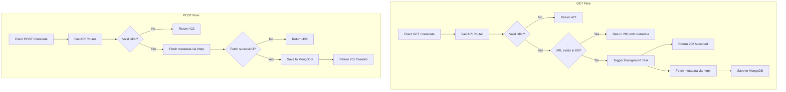

# cloudsek_test

Nikhilan M - SDE Backend Engineering Hiring Challenege

# HTTP Metadata Inventory Service

An asynchronous HTTP metadata collection service built with FastAPI and
MongoDB.

This service allows clients to submit a URL for metadata extraction and
retrieve previously stored metadata. If metadata is not available, the
service triggers background collection and responds immediately without
blocking for all subsequent retrieval attempts.

------------------------------------------------------------------------

## Features

-   Asynchronous FastAPI application
-   Non-blocking metadata retrieval (202 Accepted on cache miss)
-   MongoDB persistence with unique index on URL
-   Structured logging
-   Health endpoints
-   Dockerized setup
-   Async test suite using pytest
-   URL validation using Pydantic

------------------------------------------------------------------------

## Architecture Overview

The application follows a layered design:

-   API Layer (FastAPI routers)
-   Service Layer (business logic)
-   Repository Layer (MongoDB operations)
-   HTTP Fetcher Layer (external HTTP calls via httpx)

### Metadata Retrieval Flow



------------------------------------------------------------------------

## API Endpoints

### POST `/metadata`

Creates metadata for a given URL.

**Request Body**

``` json
{
  "url": "https://example.com"
}
```

**Responses**

-   `201 Created` -- Metadata successfully fetched and stored
-   `422 Unprocessable Entity` -- Invalid URL
-   `400 Bad Gateway` -- Failed to fetch metadata from target URL

------------------------------------------------------------------------

### GET `/metadata?url=...`

Retrieves metadata for a given URL.

**Responses**

-   `200 OK` -- Metadata found
-   `202 Accepted` -- Background collection started
-   `422 Unprocessable Entity` -- Invalid URL

------------------------------------------------------------------------

### GET `/health`

Liveness check.

Returns:

``` json
{
  "status": "ok"
}
```


------------------------------------------------------------------------

## Metadata Collected

For each URL, the following fields are stored:

-   URL
-   Response headers
-   Cookies
-   HTML page source

------------------------------------------------------------------------

## Running Locally

### Using uv

Install dependencies:

``` bash
uv sync
```

Start the application:

``` bash
uv run uvicorn app.main:app --reload
```

Open:

    http://localhost:8000/docs

------------------------------------------------------------------------

## Running Tests

``` bash
uv run pytest
```

------------------------------------------------------------------------

## Running with Docker

``` bash
docker compose up --build
```

API will be available at:

    http://localhost:8000/docs

------------------------------------------------------------------------

## Stopping Docker and Resetting MongoDB

``` bash
docker compose down -v
```

------------------------------------------------------------------------

## Stopping Docker (Preserving MongoDB Data)

``` bash
docker compose down
```

------------------------------------------------------------------------

# Environment Configuration
Create a .env file in the project root
``` bash
MONGO_URI=mongodb://localhost:27017
DB_NAME=metadata_db
LOG_LEVEL=INFO
```

Variable Descriptions:
-  MONGO_URI — MongoDB connection string
-  DB_NAME — Database name used by the application
-  LOG_LEVEL — Logging level (DEBUG, INFO, WARNING, ERROR)

------------------------------------------------------------------------

## Project Structure

    ├── app
    │   ├── api
    │   │   ├── health.py
    │   │   └── metadata.py
    │   ├── core
    │   │   ├── config.py
    │   │   └── logging.py
    │   ├── db
    │   │   ├── client.py
    │   │   └── repository.py
    │   ├── models
    │   │   ├── document.py
    │   │   └── schemas.py
    │   ├── services
    │   │   ├── fetcher.py
    │   │   └── metadata_service.py
    │   ├── workers
    │   │   └── background.py
    │   └── main.py
    │
    ├── tests
    │   ├── conftest.py
    │   └── test_api.py
    │
    ├── Dockerfile
    ├── docker-compose.yml
    ├── docker-compose-db.yml
    ├── pyproject.toml
    ├── uv.lock
    └── README.md


